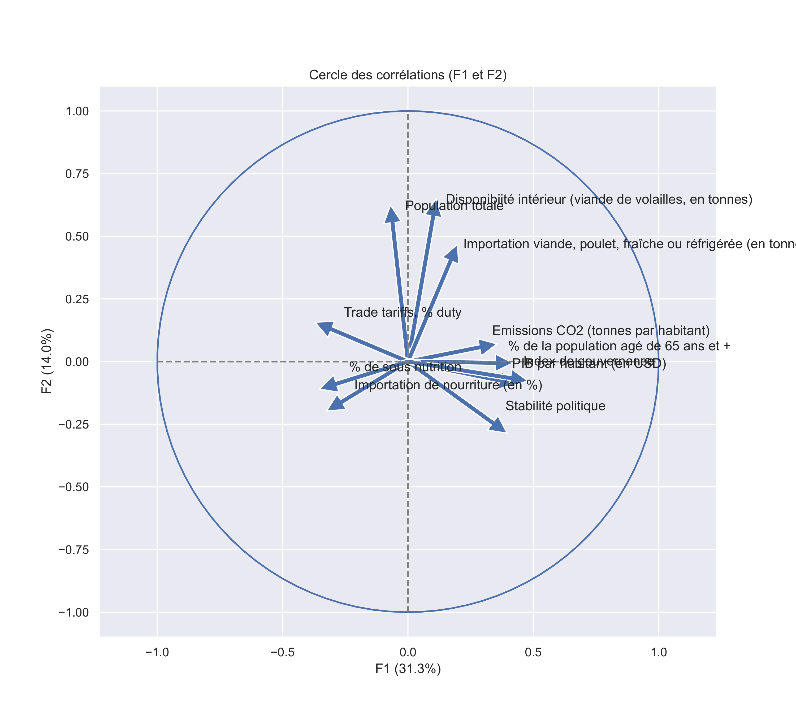
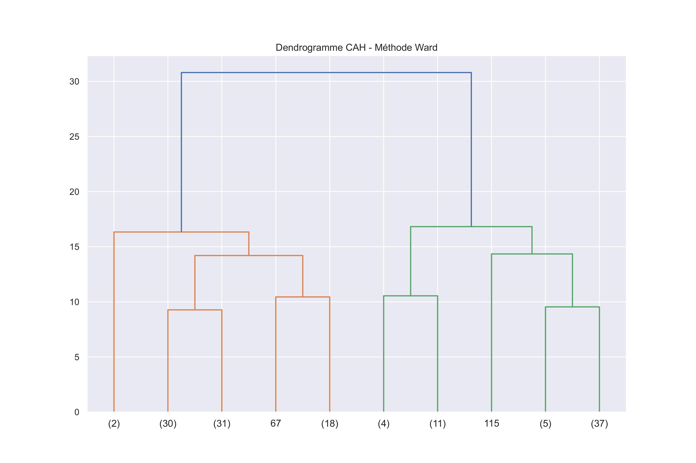
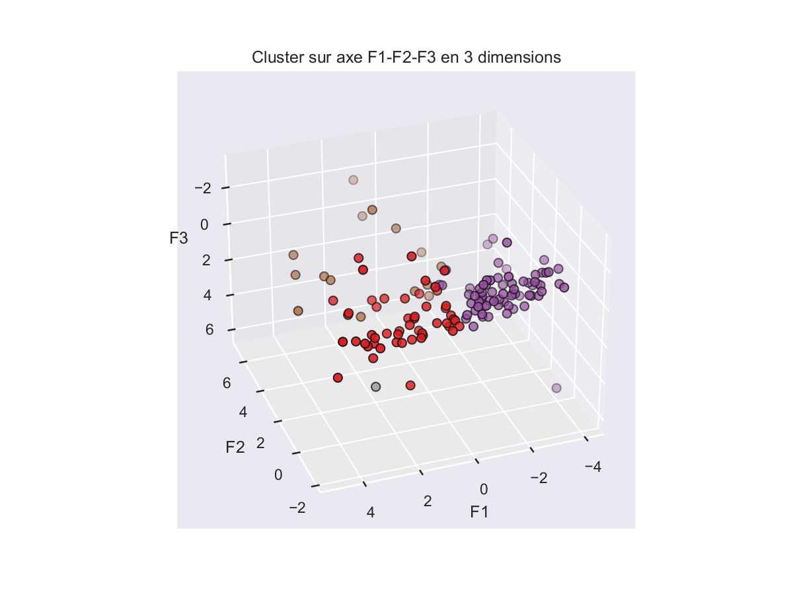
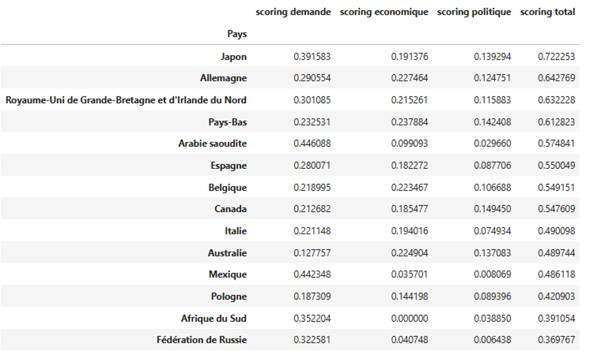

# 🐔 Étude de marché – Export de volaille

---

## 🎯 Objectif business

Identifier les pays les plus attractifs pour l’exportation de volaille en combinant des données économiques, démographiques, de consommation et de gouvernance.

---

## 🧠 Approche globale

Ce projet repose sur 3 étapes principales :

1. Exploration et compréhension des données
2. Réduction de dimension et segmentation des pays
3. Construction d’un score d’attractivité et recommandation finale

---

## 📊 1. Exploration des données (EDA)

### Analyse réalisée :
- Étude des distributions des variables
- Analyse des corrélations
- Identification des relations entre facteurs économiques et consommation

---

## 🧬 2. Réduction de dimension (ACP)

### Objectif :
Simplifier l’information tout en conservant l’essentiel de la variance.

### Méthodes :
- Standardisation des données
- Analyse en Composantes Principales (ACP)
- Analyse des axes principaux

### 📌 Visuels :

---

## 📦 3. Segmentation des pays

### Objectif :
Regrouper les pays selon leurs caractéristiques communes.

### Méthodes :
- K-means
- Classification hiérarchique (CAH)

### 📌 Visuels :

---

## 🧮 4. Scoring des pays

### Objectif :
Créer un classement final basé sur des critères pondérés.

### Méthode :
- Définition de variables pondérées (économie, consommation, gouvernance…)
- Calcul d’un score global d’attractivité

### 📌 Visuels :

---

## 🌍 5. Recommandation finale

Les pays ont été classés selon leur score d’attractivité afin de définir une stratégie d’exportation.

### Résultats :
- Identification d’environ 15 pays prioritaires sur ~150
- Segmentation en profils :
  - Marchés à fort potentiel immédiat
  - Marchés émergents à potentiel stratégique
  - Marchés peu prioritaires

### 📌 Visuel clé :

---

## 🛠️ Outils utilisés

- Python (Pandas, NumPy)
- Scikit-learn
- Matplotlib / Seaborn
- Analyse multivariée
- Clustering (K-means, CAH)
- ACP

---

## 📌 Conclusion

Ce projet illustre une démarche complète de data analysis :
- Exploration des données
- Modélisation statistique
- Segmentation
- Construction d’un score décisionnel
- Recommandation business

---

## Documents
- Présentation : 'presentation_projet_export_international.pdf'
- Notebook nettoyage : 'preparation_nettoyage.ipynb'
- Notebook clustering : clustering_visualisation.ipynb'

## 👤 Auteur
Yoann De Cler
