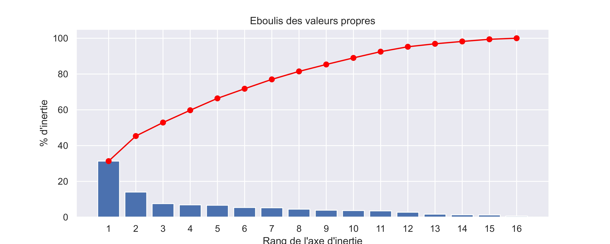

# 🐔 Étude de marché – Export de volaille

---

## 🎯 Objectif
Identifier les pays les plus attractifs pour l’exportation de volaille à partir de données économiques, démographiques, de consommation et d'index de gouvernance.

---

## 🧪 Démarche analytique

### 1. Collecte et préparation des données
- Intégration de données open data internationales
- Nettoyage et traitement des valeurs manquantes
- Harmonisation des variables pour analyse

### 2. Analyse exploratoire (EDA)
- Étude des distributions
- Analyse des corrélations entre variables clés
- Identification des premiers facteurs explicatifs

### 3. Réduction de dimension
- Standardisation des données
- Application d’une Analyse en Composantes Principales (ACP)
- Analyse des cercles de corrélation

### 4. Segmentation des pays
- Clustering (K-means et CAH)
- Regroupement des pays selon leur potentiel de marché

---

## 📊 Résultats
- Identification d’environ 15 pays à fort potentiel sur ~150 analysés
- Segmentation des pays en profils distincts :
  - Marchés matures à forte consommation
  - Marchés émergents en croissance
  - Marchés peu attractifs (faible pouvoir d’achat ou consommation)

---

## 💡 Recommandations
- Ciblage prioritaire des pays à fort pouvoir d’achat et forte consommation

---

## 🛠️ Outils
- Python (Pandas, Scikit-learn, Matplotlib)
- Analyse multivariée
- Clustering (K-means, CAH)

---

## 👤 Auteur
Yoann De Cler
